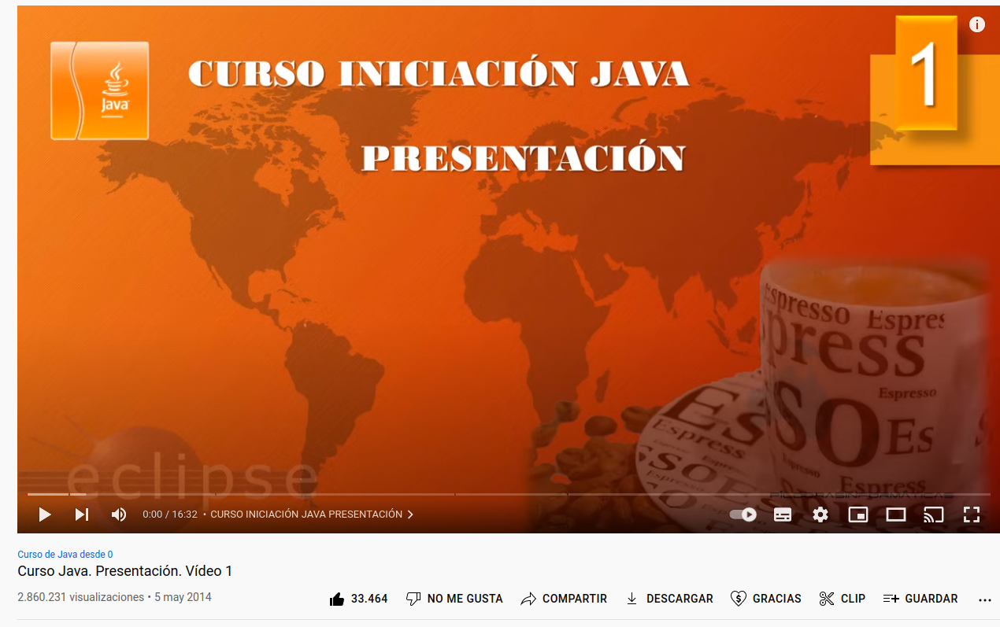

<h1>I will introduce you to "MyChat"</h1>

 
 

 
 

`A chat application that works with Client - Server architecture`

 

Client> Application that makes requests to the server.

In this case, it implies the request to communicate using MyChat
with another Client through the Server.

 

Server> A program that receives a request, performs the required
service, and returns the results in the form of a response.

 

###                   MYCHAT-SERVER IS   THIS IS THE SERVER'S APP

 

`Follow the steps below to be able to run the application on your PC`

1) Clone the project

2) in terminal type "export PORT = (the desired port)

3) Run the command mvn clean package

4) Run the command "java -jar ./target/Server-1.0-SNAPSHOT"

 

MyChat was created following "Pildoras Informaticas" 's YouTube Java course.
 

 

